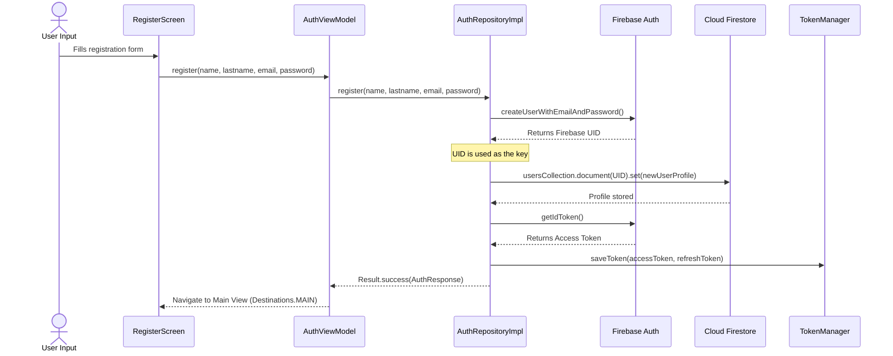

# Firebase Authentication & Database Integration Guide

This document explains how user registration, login, and profile persistence are structured and integrated in the **Where's XYZ** project.

---

## 1. Architecture Overview

The authentication and profile storage architecture relies on two separate Firebase services:
1. **Firebase Authentication (Auth)**: Manages credentials securely (emails, passwords, OAuth providers) and handles session tokens.
2. **Cloud Firestore (Database)**: Stores the user profiles and metadata (names, emails, user codes, avatar photos) under the `users` collection.

These services are bound together by the user's **UID** (User ID), which serves as the unique key in both systems.

```
       +---------------------------------------------+
       |                  Client UI                  |
       |  (LoginScreen, RegisterScreen, ProfileTab)  |
       +----------------------+----------------------+
                              |
                     [ AuthViewModel ]
                              |
                  [ AuthRepositoryImpl ]
                              |
             +----------------+----------------+
             |                                 |
    [ Firebase Auth ]                 [ Cloud Firestore ]
 - Stores credentials (email/pw)   - Stores profile records
 - Signs in/up users               - Collection: "users"
 - Generates String UID            - Document ID: UID (String)
             |
             +--------[ TokenManager ]---------+
             | Saves Access Token (UID)        |
             | in EncryptedSharedPreferences   |
             +---------------------------------+
```

---

## 2. Authentication Flows

### Registration Flow

When a user registers with a name, lastname, email, and password:

1. **Credentials Creation**: The app calls `firebaseAuth.createUserWithEmailAndPassword(email, password)`. Firebase Auth validates the input, registers the credentials, and returns a unique **UID** string (e.g., `BhJkuLTZRLYx5hxIkwn08NmonMY2`).
2. **Profile Creation**: Using the retrieved UID, the app creates a `User` profile object with a randomized 4-digit `userCode` and sets the `id` field to the **UID** string.
3. **Database Write**: The app writes the profile record to Firestore at the path `users/{uid}`.
4. **Session Token Storage**: The app fetches the current user's ID token and passes it to `TokenManager` to be saved locally for automatic login on next startup.



---

## 3. Session Persistence (`TokenManager`)

To prevent users from having to log in every time they open the app, the project uses **`TokenManager`** to persist session states:

* **Security**: It stores tokens in **`EncryptedSharedPreferences`** utilizing AES-256 encryption.
* **Token Validity**: The `isTokenValid()` check runs during the splash screen (`SplashScreen`). If the saved token exists and has not expired, the app automatically fetches the current user profile from Firestore and logs them in.
* **Logout**: When the user logs out, the app signs out of Firebase Auth (`firebaseAuth.signOut()`) and calls `tokenManager.clearToken()` to erase the secure preference values.

---

## 4. Database Schema Design (Firestore)

User profiles are stored in the **`users`** collection. Each user record is a separate document keyed by their Firebase Auth UID:

```json
users (Collection)
  |
  +-- [UID_String] (Document ID, e.g. MjSftRTX0fNDOtMXIpGSvGu7jve2)
        |
        +-- id: "MjSftRTX0fNDOtMXIpGSvGu7jve2" (String)
        +-- email: "user@example.com" (String)
        +-- userCode: 2674 (Integer, 4-digit code)
        +-- name: "John" (String)
        +-- lastname: "Doe" (String)
        +-- userPhoto: null (String or null)
```

### Key Schema Points:
* **No-Argument Constructor**: The `User` data class properties have default values (e.g. `val email: String = ""`), which is required by Firestore to instantiate the class automatically during reads.
* **Groups and Pings**: Active user groups and pings are **not** stored in this Firestore document. They are handled dynamically in the **Realtime Database** (under `/groups` and `/pings`) because location sync requires a low-latency, real-time streaming database, whereas user profiles are static document-based metadata.

---

## 5. Summary of Files Involved

* **Model**: [User.kt](file:///C:/Users/dawid/StudioProjects/WheresXYZ/app/src/main/java/com/example/wheresxyz/data/model/User.kt)
  Defines the schema of the user profile.
* **Repository Interface**: [AuthRepository.kt](file:///C:/Users/dawid/StudioProjects/WheresXYZ/app/src/main/java/com/example/wheresxyz/data/repository/AuthRepository.kt)
  Exposes the suspending auth methods.
* **Repository Implementation**: [AuthRepositoryImpl.kt](file:///C:/Users/dawid/StudioProjects/WheresXYZ/app/src/main/java/com/example/wheresxyz/data/repository/AuthRepositoryImpl.kt)
  Coordinates requests between `FirebaseAuth`, `FirebaseFirestore`, and `TokenManager`.
* **DI Binding**: [AppModule.kt](file:///C:/Users/dawid/StudioProjects/WheresXYZ/app/src/main/java/com/example/wheresxyz/di/AppModule.kt)
  Binds the Repository interface to the Firestore-enabled implementation.
* **Session Handler**: [TokenManager.kt](file:///C:/Users/dawid/StudioProjects/WheresXYZ/app/src/main/java/com/example/wheresxyz/data/local/TokenManager.kt)
  Encrypts and persists local session details.
